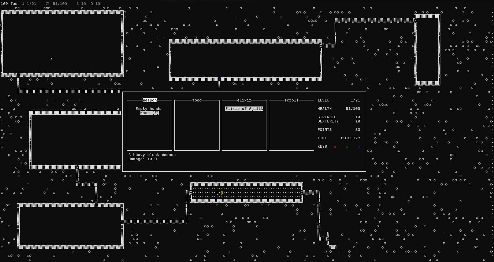
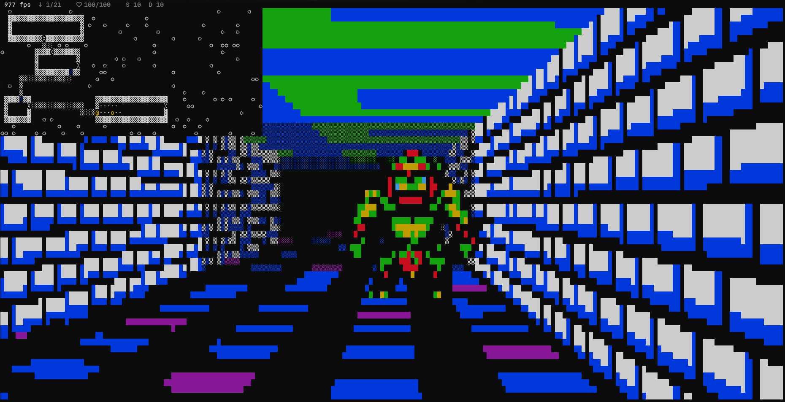

# ROGUE

Rogue, short for "rogue" or "scoundrel," is a computer game developed by Epyx in 1980. Its core theme is dungeon exploration. Rogue was hugely popular on university Unix systems in the early 1980s and gave birth to an entire genre of games known as roguelikes.

In Rogue, players take on the classic fantasy role of an adventurer. The game begins on the uppermost level of an unmapped dungeon filled with monsters and treasures. As players progress deeper into the randomly generated dungeon, the enemies grow stronger and the challenges intensify.

## Gameplay

Each dungeon level consists of a 3×3 grid of rooms or dead-end corridors that would have otherwise led to a room. Later versions of the game added "mazes" — winding corridors filled with dead ends — alongside traditional rooms. Unlike most adventure games of that era, Rogue uses procedural generation to create unique and equally risky dungeon layouts and item placements for both newcomers and seasoned players.



The player has three main attributes: health, strength, and experience. All three can be increased by using potions or scrolls and decreased by stepping on traps or reading cursed scrolls. The wide variety of magical potions, scrolls, wands, weapons, armor, and food results in rich, diverse gameplay with many different paths to victory or defeat.



## Installation and Launching

Use [`uv`](https://docs.astral.sh/uv/#installation) it is that simple!

Windows

```bash
    uv sync --extra windows
    uv run game.py
```

Linux

```bash
    uv run game.py
```

If you have any troubles with `uv` building `simpleaudio` binary simply install `libasound2-dev`

Debian:

```bash
sudo apt install libasound2-dev
```

##### There is no simple solution for WSL audio driver
